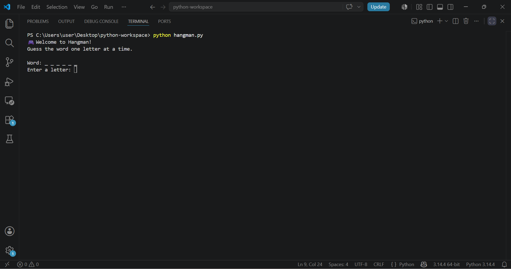
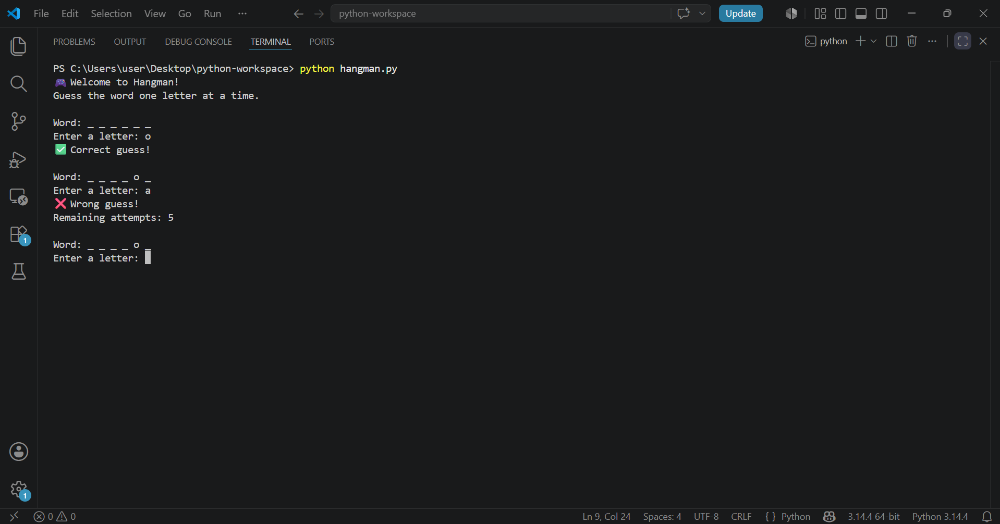
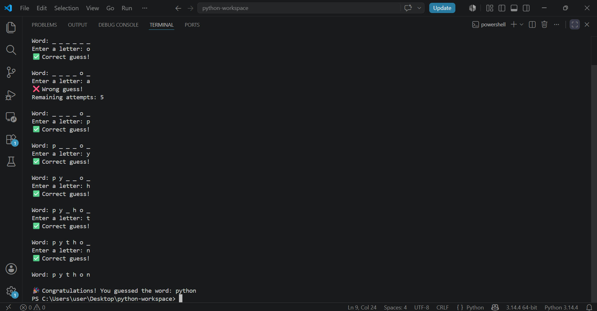

# CodeAlpha_Hangman
A classic command-line Hangman game built with Python. Features random word selection, input validation, and an interactive live-score/attempt system.

## Screenshots

### Game Start

### Game Progress

### Game Result

